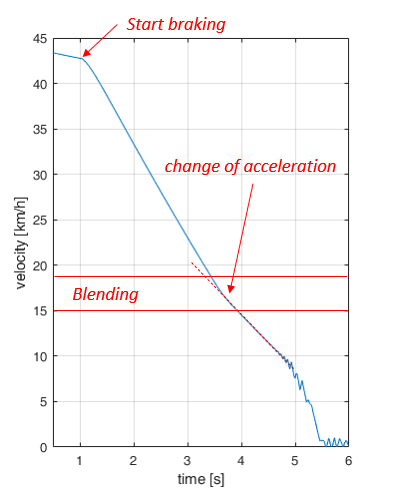
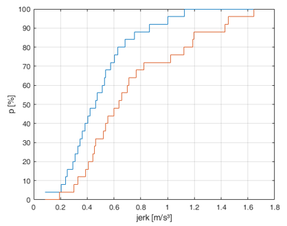
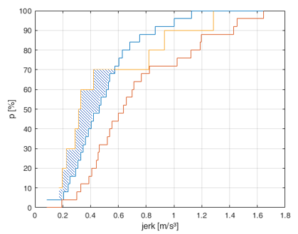
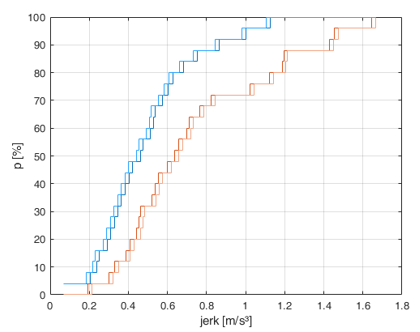
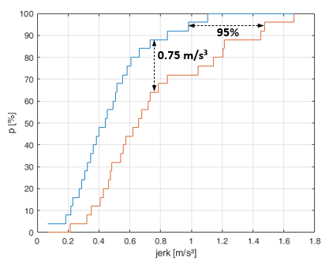

# Uncertainty Quantification Example

## Scenario :car:

Electrified vehicles use brake recuperation to decelerate the vehicle. However, brake recuperation is limited in terms of amount and velocity.

For instance, for lower speeds (typically below 20 km/h), the "classical" friction brake has to take over the deceleration task. Typically, this 
is done by blending recuperational brake and friction brake. 

During and after this blending, the deceleration may differ, as the real value of the friction of the brake discs varies a lot (around +/- 15 %), 
compared to the value that is assumed in the control unit. Moreover, other parameters may differ, like the real mass of the vehicle, compared to 
the estimated mass in the control unit.

## Problem :exclamation:

The change of the decelration in this scenario is resulting in a jerk (the jerk is defined as the derivation of the acceleration) of the vehicle that can be uncomfortable to the passengers.

## Task :notebook_with_decorative_cover:

Taking into account uncertainties of the mentioned parameters, try to give a statement how likely it is that the resulting jerk is below a certain threshold (e.g. 0.75 m/s³).

## Approach :fast_forward:

We will use a system simulation, consisting of a "brake blending" algorithm, wheel models and a longitudinal dynamic model of the vehicle (with decelration request as an input and acceleration and jerk as ouputs) to estimate the jerk in specific conditions.

We will make use of the aleatory and epistemic uncertainties of the following parameters, to generate a design of experiment for the simulation.
- friction of the brake discs
- friction radius of the brake discs
- mass of the vehicle
- dynamic wheel radius

## Single Steps :hourglass:

To reach this goal, we will make use of the following steps, that will be executed in the [github action pipeline](./.github/workflows/generate_results.yml) of this repository that implements the [Framework for V&V and Uncertainty Quantification in Scietific Computing](https://arc.aiaa.org/doi/abs/10.2514/6.2010-124) by Christopher Roy and William Oberkampf.

### 1. Create a Doe (Design of Experiment)

With the [specification of the parameters](./parameters/parameter_specifications/), we will create a DoE, taking into account the aleatory uncertainties (uncertainties with known probability distribution) and epistemic uncertainties (uncertainties with unknown probability distributions) of the parameters.

We will use my [**Parameter** library in the Credibility-Development-Kit](./Credibility-Assessment-Framework//Credibility-Development-Kit/util/parameter/README.md) to create the DoE.

The number of experiments and runs per experiment is depending on the number of parameters with epistemic and alreatory uncertainties, as these uncertainties have to be treated different.

The DoE will have 1000 simulation runs, each one with different parameter values. We are going for 40 experiments with 25 runs each.

### 2. Create inputs for the Simulation

As the target simulation tool [OpenMCx](https://github.com/eclipse/openmcx) is using the [SSP standard](https://ssp-standard.org/) to define the system, we need create SSV files (System Structure Parameter Values) and integrate them into the target SSD file (System Structure Definitions).

In this step, 1000 different SSD files will be generated.

### 3. Run simulations

To run the 1000 simulations, we are using my [custom github action](https://github.com/localhorst87/run-openmcx) with just two lines of code.

### 4. Analyze time-series data

We convert and analyze the results of the simulations (time-series data) to extract the value we are interested in: The maximum value of the jerk during blending.

To ease the analysis part, we are using my [**Signal** library in the Credibility-Development-Kit](./Credibility-Assessment-Framework/Credibility-Development-Kit/util/signal/README.md).

In the end we will have 25 discrete values of the maximum jerk, for each of the 40 experiments.

### 5. Create P-Boxes of the discrete results

Each of the 40 experiments has 25 discrete values, that will be treated as a discrete [EDF](https://en.wikipedia.org/wiki/Empirical_distribution_function#:~:text=In%20statistics%2C%20an%20empirical%20distribution,of%20the%20n%20data%20points.).

To condense the 40 EDFs, we will create [P-Boxes](https://en.wikipedia.org/wiki/Probability_box) from it. We will make use of my [**Uncertainty** library in the Credibility-Development-Kit](./Credibility-Assessment-Framework//Credibility-Development-Kit/util/uncertainty/README.md).

### 6. Evaluate and add model form uncertainty

To evaluate the error of the simulation, we will compare the simulation results to the (sparse) existing data from real measurements. For this, we are using the [Area Validation Metric](./Credibility-Assessment-Framework/Credibility-Development-Kit/metrics/evaluation/level_3/README.md) and add the resulting difference as uncertainty to the P-Boxes of the simulation results.

*Model Form Uncertainty (hatched) between the simulation P-Boxes (blue and red stairs) and the EDF of the validation measurements (yellow stairs)*

*Extended P-Boxes (by adding the model form uncertainty) compared to the origin values*

### 7. Use final P-Boxes for the statement

We will use the final P-Boxes to make a statement. In our example, we can evalute the probability that the jerk is below 0.75 m/s³ to be between 64 % and 88 % and for the 95th percentile, the jerk lies between 0.98 and 1.47 m/s³.

*Identification of values from the P-Boxes for the final statement*